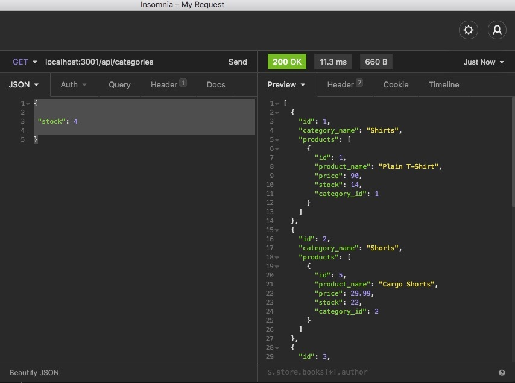
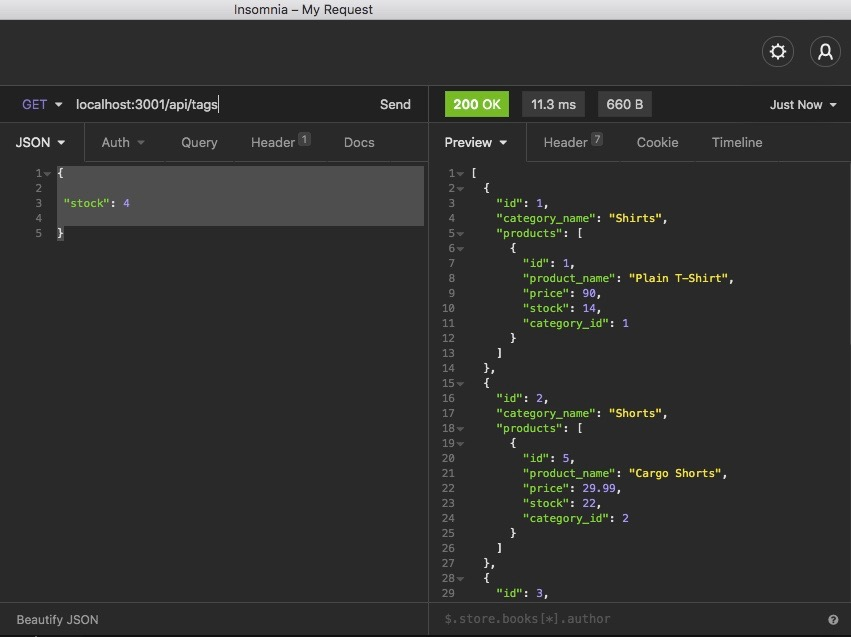
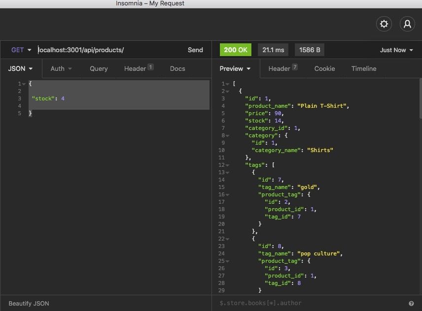

# eCommerce-back-end

## Description 
This back-end application is for an e-commerce store. By being able to access the different API categories, the user can input new data, retrieve data and delete data. In this streamlined application, the user can also connect to mySql via the sequelize NPM package and populate the data in their tables, which makes life much easier than manually inserting the data.

## Installation
Make sure to download all necessary NPM packages, which include Express, Sequelize, dotENV and MySQL2. Have a working MySQL database up and running with the information from your schema.

## Contributions
Chelsey Morris was the sole contributor on this project

## Contact
email: chelseymorris91@yahoo.com
[link to LinkedIn!](https://www.linkedin.com/in/chelsey-morris-758590204/)
[link to Github!](http://github.com/cmorris91)

## Links

Repo:
[link to Github!](https://github.com/cmorris91/eCommerce-back-end)

[link to screen recording!](https://drive.google.com/file/d/1Y3BcS1iIh857yhMy-Y6D5fZfuoiPaHz4/view)

[link to screen recording 2!](https://drive.google.com/file/d/1MLKNebuNdrPQW-4tdfVlpEHK2XrDPBxH/view)

## Screenshots

## License 
